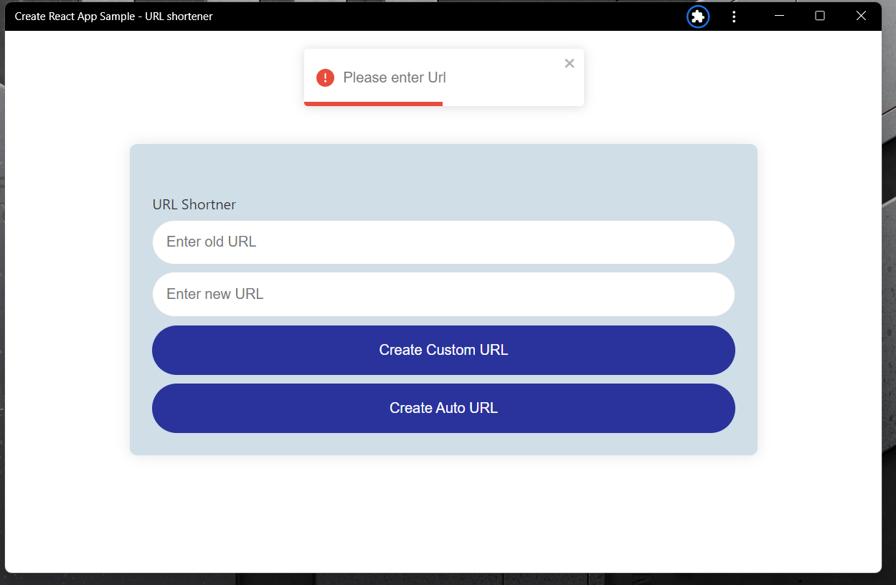
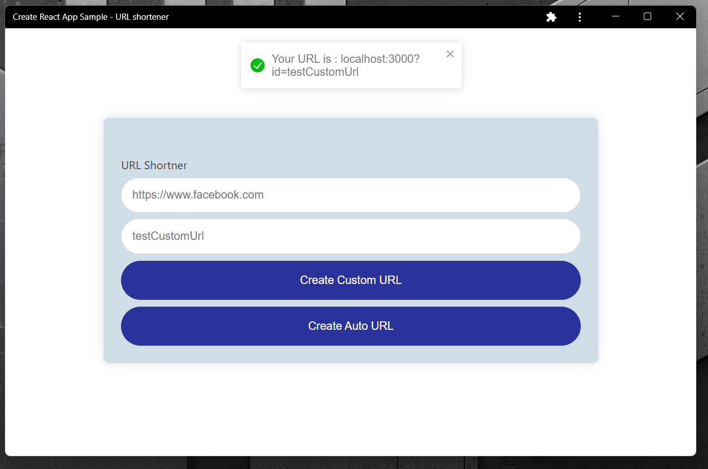

<html>
<h1>URL Shortener</h1>
    <h2>
    Table of contents
    </h2>
    <h3> 
        <ul>
            <li>Project Title</li>
            <li>Table of contents</li>
            <li>Description</li>
            <li>Preview</li>
        </ul>
    </h3>
     
    <h2>Description</h2>
    <h4>Simple URL Shortener created with PERN(Postgres,Express,React,Node).It can auto generate links and you can also enter a custom link extension.
    </h4>
    <h2>Preview</h2>
     
    
     
    
     
</html>